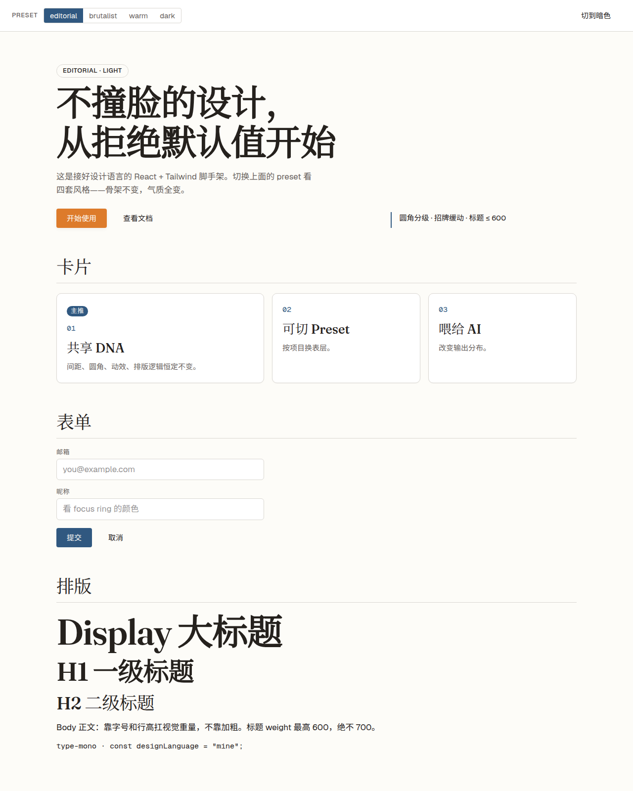

# 我的设计语言（Personal Design Language）

一套**共享 DNA + 多 Preset** 的个人设计系统。目的：让 codex / gemini / claude 任意一家生成的 UI 都收敛到**我的风格**，而不是语料库均值（"AI slop"）。

## 这是什么

- **共享 DNA**：间距节奏、圆角哲学、动效缓动、排版逻辑、Nevers 清单、页面级反 slop 审稿 —— 所有项目恒定不变，这是辨识度来源。
- **4 套 Preset**：`editorial` / `brutalist` / `warm` / `dark` —— 按项目情形切换表层（颜色/字体/质感），每套含亮/暗双主题。
- **AI 交付门禁**：生成 UI 前先做 `Design read / Design risks / Preflight target`，交付前再用反 slop 清单审首屏、节奏、视觉资产、状态与文案。
- **Redesign Audit**：接已有项目时先输出 `Mode / Problems / Plan / Do not change`，保住业务信息、品牌资产和信息架构，不让 AI 为了“变好看”乱改内容。
- **机制吸收，不照抄**：吸收优秀 design skill 的任务分档、两轮审稿、确定性检测、动效工艺；不照搬评分、品牌话术或另一套审美。

## 新增的反 AI slop 工作流

这套设计语言不只给 token，还给 AI 一套审稿流程：

1. **读设计**：确认页面类型、目标用户、当前 preset、明暗主题。
2. **报风险**：先指出最容易滑向 AI slop 的 2–3 个点，例如假截图、满页标签、同义 CTA、无来源精确数字。
3. **定门禁**：列出本次交付必须通过的 3–5 条审稿规则。
4. **再写 UI**：只使用语义变量、分级圆角、具名过渡、preset 指纹，不碰默认 Tailwind 蓝紫渐变/毛玻璃套路。
5. **交付前审稿**：重要页面走“截图/交互实测 → 视觉/工程/业务三视角评审 → 精修”；如果是 redesign，还要明确哪些内容不能改。

能写成脚本的规则优先进入 CI / lint，例如 root 与 starter 文档同步、禁默认 Tailwind 色、禁 `transition-all`；prompt 负责判断，脚本负责兜底。

## 四套 Preset 一览

同一套骨架，四种气质。切 preset 一行代码，颜色 / 字体 / 质感全变：

| editorial（编辑杂志） | brutalist（几何粗野） |
|---|---|
|  |  |
| **warm（温润亲和）** | **dark（冷感科技）** |
|  |  |

## 快速开始（跑起 starter 看效果）

```bash
git clone <repo-url> design-language
cd design-language

# 配齐字体（首次必跑，字体不进仓库，见 FONTS.md）
./scripts/fetch-fonts.sh --subset starter

# 跑脚手架
cd starter && bun install && bun run dev
```

打开后用页面顶部的 preset 切换器，看四套风格 + 明暗切换。

> 怎么在新项目里调用这套设计语言（开新项目 / 接已有项目 / 喂 AI / 交付前审稿）见 **[USAGE.md](USAGE.md)**。

以后每次开新 UI 项目，先执行一次检查/注入：

```bash
dl-apply --check . || dl-apply . editorial
```

完全新项目优先复制 `starter/`；已有项目或脚手架生成后的项目用 `dl-apply` 注入 `AGENTS.md`。

## 文件结构

```
design-language/
├── DESIGN.md              # ★ 核心：喂给 AI 的规范（DNA + nevers + 审稿协议）
├── PROPOSAL.md            # 完整方案与设计背景（为什么这么做）
├── tokens/
│   ├── core.json          # 共享 DNA（W3C DTCG 格式）
│   ├── preset-editorial.json
│   ├── preset-brutalist.json
│   ├── preset-warm.json
│   └── preset-dark.json   # 4 套表层 token
├── presets/
│   ├── editorial.md       # 每套 preset 的 AI 喂养片段 + 参考点
│   ├── brutalist.md
│   ├── warm.md
│   └── dark.md
├── css/
│   └── tokens.css         # ★ 可直接用：CSS 变量 + data-preset 切换 + 明暗
├── tailwind/
│   └── theme.css          # Tailwind v4 @theme 映射（整体替换默认色板）
├── starter/               # ★ React 19 + Vite 6 + Tailwind v4 脚手架，复制即开新项目
├── scripts/               # 字体下载 + subset 工具链（fetch-fonts.sh）
├── FONTS.md               # 字体来源与授权说明
└── LICENSE                # MIT（代码），字体各自独立授权
```

## 在新项目里怎么用

### 1. 喂给 AI（核心价值）
在项目里新建 `CLAUDE.md` / `.cursorrules` / codex 上下文，放入：
- `DESIGN.md` 全文（或其压缩版）
- 当前项目选用的 `presets/<name>.md`

这样 AI 的"最可能输出"就从语料均值变成「我的 DNA + 当前 preset」。

生成或重构 UI 时，先要求 AI 给三行短声明：`Design read` / `Design risks` / `Preflight target`；交付前再按 `DESIGN.md` 的页面级反 slop 清单审首屏、section 节奏、视觉资产、状态、文案。

### 2. 接入样式
```css
/* 主入口 CSS */
@import "./design-language/css/tokens.css";
@import "tailwindcss";
@import "./design-language/tailwind/theme.css";
```
```html
<!-- 选 preset + 明暗 -->
<html data-preset="editorial" data-theme="light">
```

### 3. 写组件
- 颜色只用语义类/变量：`bg-bg` `text-text` `bg-accent` `text-cta` / `var(--color-accent)`
- 圆角用分级变量：`rounded-[var(--radius-card)]` 等
- 排版用 composite 类：`type-h1` `type-body` `type-label`
- 过渡用 `transition-ui`（招牌缓动，禁止 `transition-all`）

## 核心铁律（详见 DESIGN.md）

- 禁 Inter 标题、禁 Tailwind 默认色、禁纯黑白、禁紫渐变、禁毛玻璃、禁 `transition-all`
- 禁假截图 div、满页无信息标签、同义 CTA 堆叠、无来源精确数字、异步/数据/表单状态缺席
- 圆角分级（按钮/输入/卡片不同），不全员一致
- 标题 weight ≤ 600，靠字号行高扛重量
- 中文字体必须 subset + 系统 fallback 链
- 布局非对称，hero 非居中三等分
- 现有项目 redesign 先做 `Mode / Problems / Plan / Do not change`，不得静默改信息架构、品牌资产或真实内容

## 中文字体（已配 fallback 链）

| Preset | 中文标题 | 中文正文 |
|---|---|---|
| editorial | 思源宋体 Noto Serif SC | 思源黑体 Noto Sans SC |
| brutalist | 得意黑 Smiley Sans | 思源黑体 Medium |
| warm | 霞鹜文楷 LXGW WenKai | 思源黑体 |
| dark | MiSans / HarmonyOS Sans SC | MiSans |

生产环境记得对中文 webfont 做**子集化（subset）**，否则首屏会被几 MB 字体拖慢。
本仓库已内置完整 subset 工具链（`scripts/fetch-fonts.sh`），自动下载 + 切片（文楷 24M → ~150K）。

## 授权

- 代码 / 配置 / 设计 token / 文档：**MIT**（见 `LICENSE`）。
- 字体：仓库**不分发字体文件**，由脚本从各自官方来源下载，授权各自独立（见 `FONTS.md`）。
  其中 Geist、得意黑、文楷、思源、Fraunces、Space Grotesk 为 SIL OFL 1.1；Satoshi 为 Fontshare 免费授权；MiSans 为小米免费商用授权。
